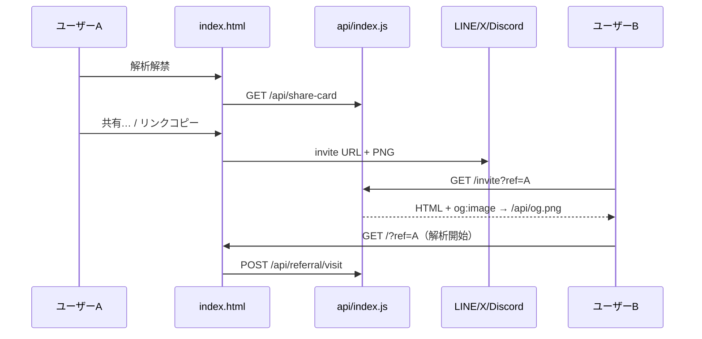

# 自律伝播 — OG / PNG / Web Share 設計書

**版:** 2026-05-30  
**実装:** `lib/social-image.js`, `lib/og-card.js`, `lib/rasterize-svg.js`, `api/index.js`, `public/index.html`

---

## 1. 目的

| 課題 | 対策 |
|------|------|
| 手動 X 投稿に依存 | ユーザー起点の **招待リンク + シェアカード** |
| `/?ref=` は静的 HTML のため OG が効かない | **`/invite?ref=`** サーバー HTML + **`/api/og.png`** |
| SVG だけでは SNS 保存・一部クローラが弱い | **PNG**（サーバー `@resvg/resvg-js` + クライアント Canvas フォールバック） |
| X 以外に届けたい | **Web Share API**（LINE / メール / 他アプリ） |

**禁止（維持）:** 自動 SNS 投稿、シェア強制、MLM 訴求（`KAIROS_BLUEPRINT.md` §6-3）。

---

## 2. URL 設計

| URL | 用途 |
|-----|------|
| `https://get-kairos.online/` | メイン UI。デフォルト OG は静的 `<meta>` + `/api/og.png` |
| `https://get-kairos.online/?ref=kairos_xxx` | 着地（`localStorage` + `POST /api/referral/visit`）。OG は JS で補強のみ |
| **`https://get-kairos.online/invite?ref=kairos_xxx`** | **共有用正 URL** — クローラ向け HTML + OG |
| `https://get-kairos.online/invite?ref=…&score=89&teaser=…&locale=ja` | 解析後シェア向け（スコア・抜粋付きプレビュー） |

**環境変数（任意）:** `KAIROS_PUBLIC_URL` — 本番以外・プレビュー用の絶対 URL 生成。

---

## 3. API エンドポイント

### 3-1. Open Graph 画像（1200×630）

| メソッド | パス | Content-Type | クエリ |
|----------|------|--------------|--------|
| GET | `/api/og` | `image/svg+xml` | `score`, `teaser`, `locale`, `ref` |
| GET | `/api/og.png` | `image/png` | 同上（**og:image 推奨**） |
| GET | `/api/og/meta` | `application/json` | 同上 → `title`, `description`, `pageUrl`, `imageUrl` 等 |

**クエリ正規化（`lib/social-image.js`）:**

- `score`: 77–99（未指定時 88）
- `teaser`: ja 72 字 / en 96 字で truncate
- `locale`: `ja` \| `en` \| …（OG 文案は ja/en、他は en フォールバック）
- `ref`: `^kairos_[a-z0-9_-]+$` のみ有効

**キャッシュ:** `Cache-Control: public, max-age=300`

### 3-2. シェアカード（1080×1080）

| メソッド | パス | 備考 |
|----------|------|------|
| GET | `/api/share-card` | 既存 SVG |
| GET | `/api/share-card.png` | 新規 PNG（resvg 未導入時 503 + `svgUrl` ヒント） |

### 3-3. Invite ランディング（HTML）

| メソッド | パス | 備考 |
|----------|------|------|
| GET | `/invite` | `buildInviteLandingHtml` — OG/Twitter メタ完備、`recordVisit` 1 回 |

**Vercel:** `vercel.json` で `/invite` → `/api/index` に rewrite。

---

## 4. `public/index.html` — メタタグ

### 4-1. 静的デフォルト（`<head>`）

クローラ・未解析時のフォールバック:

```html
<meta property="og:image" content="https://get-kairos.online/api/og.png"/>
<meta property="og:image:width" content="1200"/>
<meta property="og:image:height" content="630"/>
<meta name="twitter:card" content="summary_large_image"/>
```

### 4-2. クライアント補強（`?ref=` 着地時）

`updateSocialMetaFromUrl()` が以下を上書き:

- `og:title`, `og:description`, `og:url` → `/invite?ref=…`
- `og:image` → `/api/og.png?ref=…&score=…&locale=…`

**注意:** Facebook/LINE 等の初回スクレイプは **`/invite` URL を共有すること**が確実。`/?ref=` のみでは静的 HTML の OG のままの場合がある。

---

## 5. フロント — 共有 UX

| ボタン | 動作 |
|--------|------|
| **共有…** (`#share-native-btn`) | `navigator.share` — PNG `File` 対応時は画像+URL、否则 text+URL |
| **PNGを保存** | Canvas で SVG→PNG。失敗時 SVG ダウンロード |
| **招待リンクをコピー** | `https://get-kairos.online/invite?ref=…` |
| **X で共有** | 既存 intent（文案内 URL は `/invite`） |

解析完了（`accessTier: full`）後にボタン表示。`updateShareCardUi` 内で `updateSocialMetaFromUrl()` を呼ぶ。

---

## 6. フロー図



---

## 7. 運用・検証

| チェック | 方法 |
|----------|------|
| OG 画像 | `curl -I https://get-kairos.online/api/og.png` → `content-type: image/png` |
| Invite HTML | ブラウザで `/invite?ref=kairos_test` → ページソースに `og:image` |
| Facebook/LINE | 各デバッガで **invite URL** を入力 |
| PNG 503 | `npm ls @resvg/resvg-js` — Vercel 本番にデプロイ後再確認 |

---

## 8. 関連ファイル

| ファイル | 役割 |
|----------|------|
| `lib/social-image.js` | クエリ正規化・URL ビルダ |
| `lib/og-card.js` | 1200×630 SVG・invite HTML・OG meta JSON |
| `lib/rasterize-svg.js` | SVG→PNG |
| `lib/share-card.js` | 1080 シェアカード（招待 URL は `/invite`） |
| `docs/KAIROS_BLUEPRINT.md` | 成長フェーズ正本 |

---

*自動 SNS 投稿は行わない。伝播はユーザー操作とリンクプレビュー品質に依存する。*
